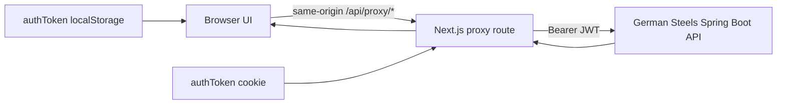

# German Steels Architecture

## Purpose

German Steels is the web administration and operations client for a field-sales organization. It covers authentication, role-scoped dashboards, employee and team management, customer/store management, visits, attendance, expenses, requirements, complaints, pricing, reports, meetings, and live locations.

## Runtime

- Next.js App Router with React and TypeScript
- Tailwind CSS and Radix UI components
- Recharts/Chart.js for reporting
- Leaflet for live locations and employee journeys
- Spring Boot backend configured through `API_PROXY_TARGET`

## Request flow



The browser never needs the EC2 origin hardcoded in individual screens. `app/api/proxy/[...path]/route.ts` reads the server-only `API_PROXY_TARGET`, forwards the request body and authorization header, and disables response caching for authenticated API data.

`app/api/image-proxy/route.ts` proxies authenticated attachments. It validates the exact configured backend origin before fetching to prevent server-side request forgery.

## Authentication and authorization

1. `app/login/page.tsx` calls `authService.login`.
2. `lib/auth.ts` posts credentials to `/user/token` and parses either JSON or the backend's role/token text format.
3. The JWT is stored in local storage for client API calls and in an `authToken` cookie for the Next.js proxy and route guard.
4. User details come from `/user/manage/get` and `/user/manage/current-user`.
5. Team membership is loaded to correct manager/field-officer role detection.
6. Root `proxy.ts` rejects missing, malformed, or expired JWTs for `/dashboard/**` and redirects authenticated users away from `/login`.

Backend access controls remain authoritative. The web role helpers only control navigation, filtering, and presentation.

## Source map

| Area | Main location | Responsibility |
| --- | --- | --- |
| Routes | `app/` | Login, dashboard screens, reports, dynamic detail pages |
| Shared layout | `components/dashboard-layout.tsx` | Sidebar, mobile navigation, page chrome, logout |
| Domain UI | `components/` | Visit, customer, employee, report, meeting, pricing and form components |
| API client | `lib/api.ts` | DTOs, authenticated request handling, typed endpoint methods |
| Authentication | `lib/auth.ts` | Login/logout, JWT persistence, role normalization |
| Team scoping | `lib/team-access.ts` | Manager and field-officer access helpers |
| API gateway | `app/api/proxy/[...path]/route.ts` | Same-origin proxy to Spring Boot |
| Attachments | `app/api/image-proxy/route.ts` | Authenticated and origin-validated file proxy |
| Route guard | `proxy.ts` | JWT expiry validation and route redirects |

## Optimized data paths

| UI need | Endpoint | Behavior |
| --- | --- | --- |
| Dashboard KPIs | `/dashboard/summary` | Returns totals and per-employee counts without downloading reports |
| Employee journey | `/visit/employee-journey` | Returns marker-ready coordinates instead of full visit objects |
| Employee header/KPIs | `/employee/dashboard-summary` | Returns visit, attendance, expense and pricing summaries |
| Employee visit rows | `/visit/getByDateRangeAndEmployeeStatsOptimized` | Returns stats, summary and a bounded Spring page |
| Customer visit history | `/visit/getByStorePaged` | Fetches only the current recent-history page |
| Manager visits | `/visit/getForTeams` | One role-scoped, paginated request for all accessible teams |
| Monthly report | `/report/getForEmployeeRange?groupBy=month` | One grouped request across the full selected range |

The compatibility endpoints remain in `lib/api.ts` because other lower-volume screens still rely on them, but the high-growth screens no longer download unbounded visit history or merge multiple team/month responses in the browser.

## State and navigation

- Authentication state is provided by `components/auth-provider.tsx`.
- Date filters and return-navigation state are persisted in session storage on the dashboard, visit list, customer list, and employee detail flows.
- Theme and sidebar preferences are stored locally.
- API page numbers are zero-based; visible UI page numbers are one-based where applicable.

## Operational commands

```bash
npm ci
npm run lint -- --quiet
npx tsc --noEmit
npm run build
npm run dev -- --port 3000
```

The backend health check is available through the application at `/api/proxy/actuator/health`.
